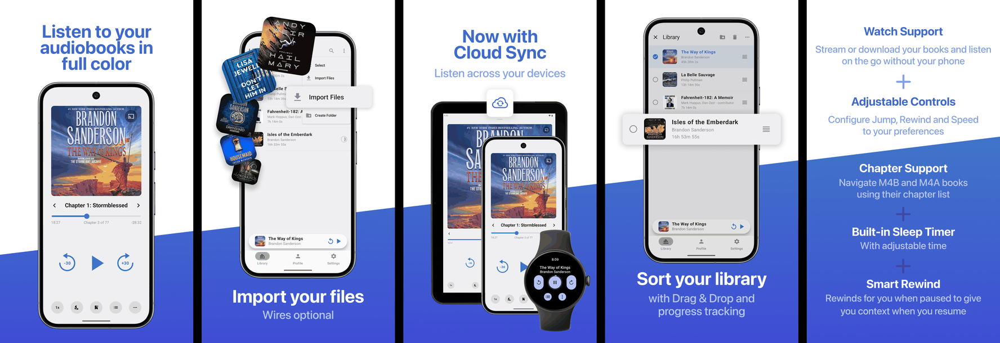

# BookPlayer for Android

A wonderful player for your M4B/M4A/MP3 based audiobooks. Native Android app built with Kotlin and
Jetpack Compose, sharing the same backend (sync, accounts and subscriptions) as
[BookPlayer for iOS](https://github.com/TortugaPower/BookPlayer).

    

See [CONTRIBUTING.md](./CONTRIBUTING.md) for setting up the project, and [`docs/`](./docs) for our
testing and debugging guides.

## Features

### Import

- Share audio files, video files and zip archives into BookPlayer from Files or any other app
- Pick individual files or whole folders from your device's storage
- Download or stream audiobooks from your own [AudiobookShelf](https://www.audiobookshelf.org) or
  [Jellyfin](https://jellyfin.org) server, including Quick Connect and single sign-on
- Zip and LPF archives are supported and are turned into folders automatically

### Manage

- Maintain and see progress of your books
- Mark books as finished
- Drag & Drop to sort your library
- Create folders
  - Automatically play items in turn
  - Move files to folders from the library or import them directly
- Edit titles, authors and artwork
- Multiselect to move, delete or edit several items at once
- Automatically track your library on [Hardcover](https://hardcover.app)

### Listen

- Control audio playback from the notification and the lock screen
- Android Auto support
- Home screen widget, plus pinned and dynamic shortcuts to jump straight into a book
- Play and navigate books with chapters
- Bookmarks
- Change playback speed and skip intervals
- Smart rewind
- Volume Boost
- Support for remote events from headset buttons and the lock screen
- Sleep timer with adjustable duration, or until the end of the current chapter
- Support for TalkBack
- Dark mode for night owls

### BookPlayer Pro

- Cloud sync
- Stand-alone playback on your Wear OS watch, with a tile and watch face complications
- Support Open Source development
- Additional color themes
- Select from alternative App Icons

### Upcoming features

See [our Roadmap on GitHub](https://github.com/orgs/TortugaPower/projects/1) for details.

### Supported locales & Languages

- English
- Arabic
- Chinese Simplified
- French
- German
- Hindi
- Italian
- Japanese
- Korean
- Russian
- Spanish

## Contributing

Pull requests and ideas are always welcomed. Please
[open an issue](https://github.com/TortugaPower/bookplayer-android/issues/new?assignees=&labels=bug&template=bug.md)
if you have any suggestions or found a bug.
👍 See our [Contribution Guidelines](./CONTRIBUTING.md) for details, including how to set up your
local environment.

If you enjoy BookPlayer, we would be glad if you consider writing a review on
[Google Play](https://play.google.com/store/apps/details?id=com.tortugapower.audiobookplayer).

### Getting started

1. Clone the repository and open it in **Android Studio** (Koala or newer).
2. Copy `local.properties.example` to `local.properties`. The `dev` flavor builds with no further
   setup; fill in `GOOGLE_CLIENT_ID`, `SENTRY_DSN` or `REVENUECAT_API_KEY` only if you want to
   exercise those features.
3. Select the **devDebug** build variant, then Build and Run.

Release signing is optional and only needed to produce signed builds — see `keystore.properties.example`.

### Maintainers

- [@GianniCarlo](https://github.com/GianniCarlo) - Original Idea & Creation
- [@Hirobreak](https://github.com/Hirobreak) - Android app

### Contributors

A full list of all contributors can be found
[on GitHub.](https://github.com/TortugaPower/bookplayer-android/graphs/contributors)

### Community

[Join us on our Discord server](https://discord.gg/MjCUXgU) if you want to contribute or talk to other
people using BookPlayer. Bugs and feature requests belong in the **#bugs-and-feedback** forum channel
there, or in [a GitHub issue](#contributing) — please don't report them in the chat channels. The
maintainers drop by once in a while, but a chat is not a bugtracker.

## Dependencies

Managed with Gradle through the [version catalog](./gradle/libs.versions.toml)

- [AndroidX Media3](https://developer.android.com/media/media3) (ExoPlayer + MediaSession) for playback
- [Jetpack Compose](https://developer.android.com/compose) with
  [Material 3](https://m3.material.io) for the UI, and
  [Wear Compose](https://developer.android.com/training/wearables/compose),
  [Tiles](https://developer.android.com/training/wearables/tiles) and
  [ProtoLayout](https://developer.android.com/training/wearables/tiles) for the watch app
- [Room](https://developer.android.com/training/data-storage/room) for local persistence
- [DataStore](https://developer.android.com/topic/libraries/architecture/datastore) for settings
- [Retrofit](https://square.github.io/retrofit/), [OkHttp](https://square.github.io/okhttp/) and
  [Gson](https://github.com/google/gson) for the BookPlayer API and media servers
- [AndroidX Credentials](https://developer.android.com/training/sign-in/credential-manager) and
  [Google Identity](https://developer.android.com/identity) for passkeys and Sign in with Google
- [AndroidX Browser](https://developer.android.com/jetpack/androidx/releases/browser) for the
  AudiobookShelf single sign-on flow
- [Coil](https://coil-kt.github.io/coil/) for artwork loading and caching
- [Google Play Billing](https://developer.android.com/google/play/billing) and
  [RevenueCat](https://github.com/RevenueCat/purchases-android) for managing in-app purchases
- [Sentry](https://github.com/getsentry/sentry-java) for crash reporting
- [Konfetti](https://github.com/DanielMartinus/Konfetti) for celebration effects
- [JUnit](https://junit.org/junit4/), [Robolectric](https://robolectric.org) and
  [MockWebServer](https://square.github.io/okhttp/#mockwebserver) for tests

## License

Licensed under [GNU GPL v. 3.0](https://opensource.org/licenses/GPL-3.0). See `LICENSE` for details.

## Legal

- [Privacy Policy](./PRIVACY_POLICY.md)
- [Terms of Use](./TERMS_CONDITIONS.md) — [General](./GENERAL_TERMS.md) · [BookPlayer Pro](./SUPPLEMENTAL_TERMS.md)
